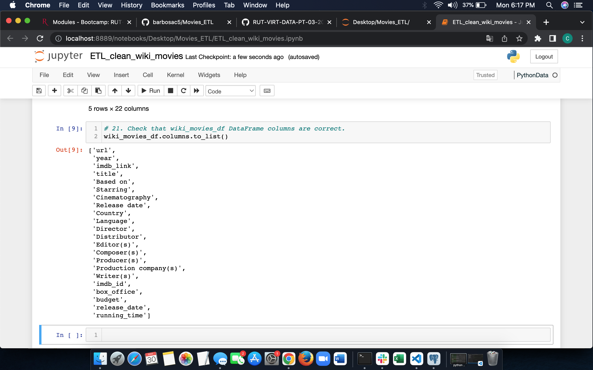

# Movies_ETL

# Overview
The purpose of this project was to create an auotmated pipeline that tkaes in new data, performs the appropriate trasnformations, and loads the data into tables. In order to do this, I refactored the code used throughout the module in jupyter notebook and added the data to a postgress SQL database.

# Results
## Deliverable 1: Write and ETL Function to Read Three Data Files
For Deliverable 1, i had to write a function that reads in the three data files and creates three seperate DataFrames.

### Deliverable 1 Output
#### wiki_movies_df (Deliverable 1)

#### kaggle_metadata

#### ratings

## Deliverable 2: Extract and Transform the Wikipedia Data
In Deliverable 2, I extracted and trasnfored the Wikipedia data so I could merge it with the Kaggle metadata. I also used a try-except block to catch all errors.

### Deliverable 2 Output
#### wiki_movies_df (Deliverable 2)

#### wiki_movies_df.columns.to_list()

## Deliverable 3: Extract and Transform the Kaggle MetaData
Deliverable 3 consistsed of extracting and transforming the Kaggle metadata and MovieLens data (ratings data) in order to conver the transformed data into seperate DataFrames. Then, I merged the Kaggle metadata DF with the wiki_movies_df to create the movies_df DataFrame. The final step consisted of me merging the Movielens ratings data DF with movies_df to create the DataFrame known as movies_with_ratings_df

### Deliverable 3 Output
#### movies_with_ratings_df

#### movies_df

### Deliverable 4: Create the Movie Database
For the final Deliverable, I used the ETL process and PostgreSQL to add the movies_df and Movielens rating CSV data to a SQL database

#### Movie Query

#### Ratings Query

# Resources
-pgAdmin version 6.8

-postgress version 11.16
